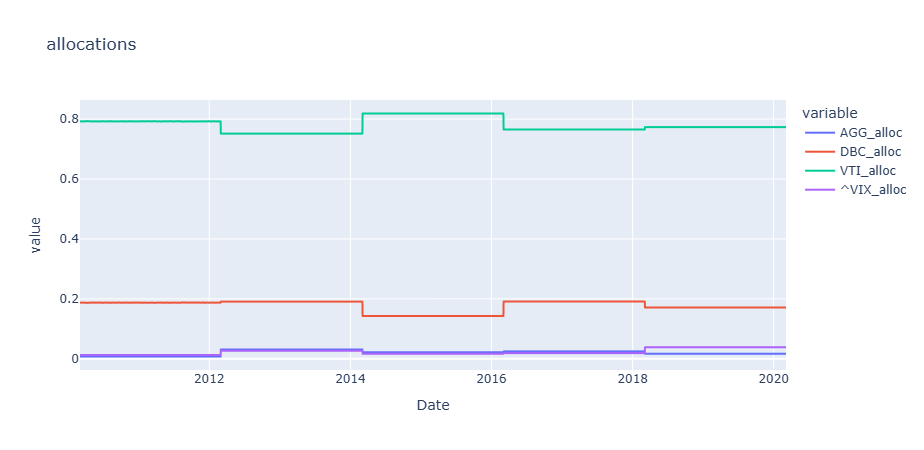
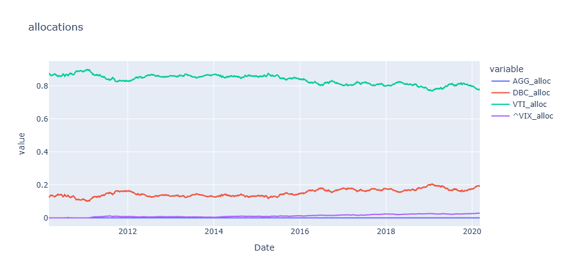
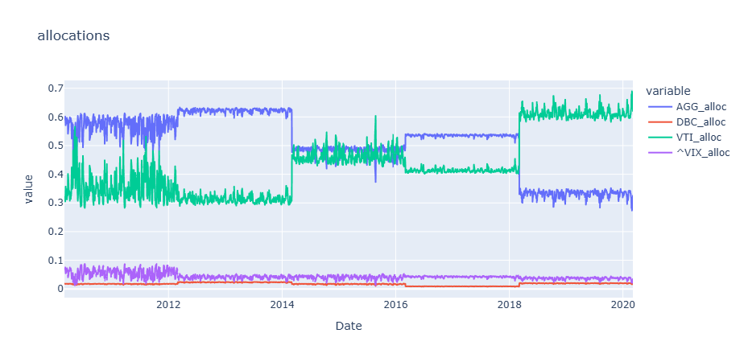
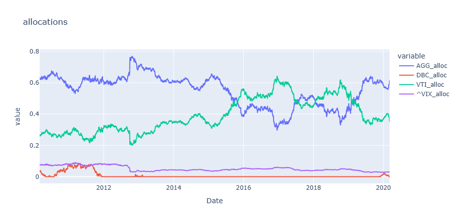

# Advanced Machine Learning Project

Github Repo for the project for the Advanced Machine Learning project @ ENSAE. Taught by M. Stromme for the final year @ ENSAE.

## Description of the project

#TODO la faire...

## Figs

#### LSTM Allocation on synthetic data

#### Markowitz portfolio Allocation on synthetic data (optimal)

#### LSTM Allocation on real data

#### Markowitz portfolio Allocation on real data (optimal)
