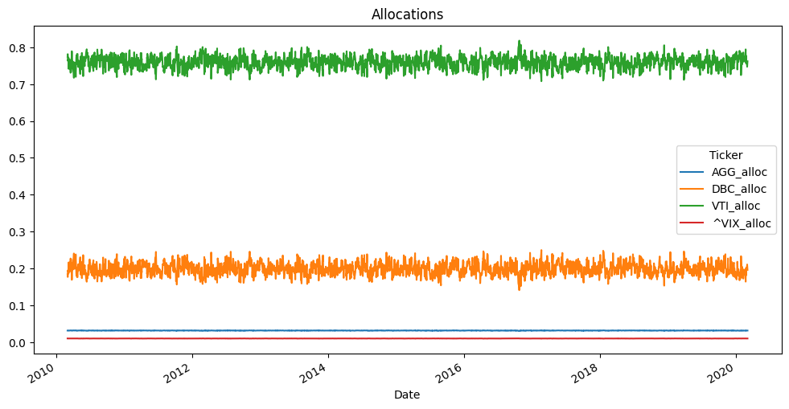
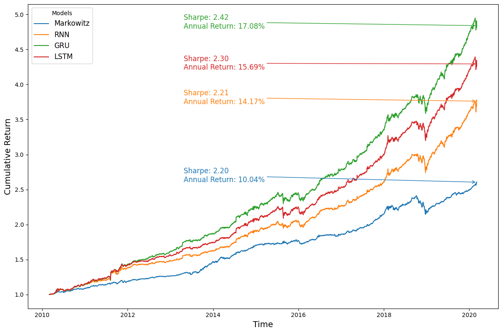

# Advanced Machine Learning Project

Github Repo for the project for the Advanced Machine Learning project @ ENSAE. Taught by M. Stromme for the final year @ ENSAE.

# Guide

The github is organised as follow:

Project

    ├── README.md
    ├── init.ipynb
    ├── pyproject.toml
    ├── setup.py
    ├── data/
    │   └── __init__.py
    ├── fig/
    │   └── __init__.py
    ├── ntbk/
    │   ├── __init__.py
    │   ├── introduction_rnn_lstm.ipynb
    │   ├── markowitzpf.ipynb
    │   ├── non_gaussian_setup.ipynb
    │   └── paper_implementation.ipynb
    ├── report/
    │   └── __init__.py
    └── src/
        ├── __init__.py
        ├── dataset.py
        ├── lstmpf.py
        ├── trainer.py
        └── viz.py

You can find the main functions in the folder ``src``. 

## Notebooks

The project contains 4 notebooks, we have:

* ``introduction_rnn_lstm`` contains an implementation of the RNN and LSTM units with numpy to show how works the architecture and the backpropagation

* ``markowitzpf`` present the optimization problem of the markowitz portfolio

* ``non_gaussian_setup`` contains an analyse of the dataset

* Finally, ``paper_implementation`` contain our results on both synthetic and real data

## Run the code

In order to run the code, after creating a venv, run the following command from the source of the repo:

```bash
pip install -e .
```

If you are working on *sspcloud*, run the command on the notebook ``init.ipynb``

## report

The report can be found on the folder ``report`` where you can find the whole latex content of the report

## Some figures


#### LSTM Allocation on synthetic data


#### Markowitz portfolio Allocation on synthetic data (optimal)


#### Results on real world dataset

